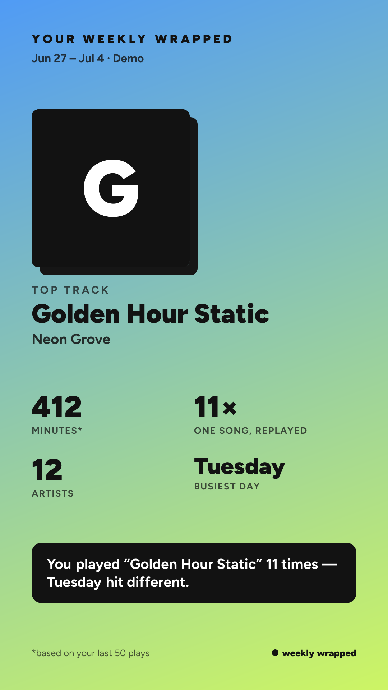

# Weekly Wrapped

<!-- Sample card: replace with a real render once you've logged in.
     Download one from the dashboard and drop it in docs/sample-card.png -->


Spotify Wrapped, but weekly. Connect your Spotify account and get a shareable
stats card every week: top track, most-replayed artist, listening-minutes
estimate, and one personality line derived from your data. The output is an
**image you can post** — plus a dashboard with song suggestions built from
your own listening.

## How it works

- **Weekly stats** come from your last 50 plays (`user-read-recently-played`).
  That's all Spotify exposes, so every weekly number is an honest estimate and
  labeled as such in the UI and on the card.
- **~4-week context** comes from your top tracks/artists (`user-top-read`,
  `short_term`). The UI is transparent about which stat comes from which window.
- **Suggestions** are derived entirely from your own data. Spotify deprecated
  the `/recommendations` endpoint for apps created after Nov 2024, so this app
  runs three honest engines instead:
  - **Rediscovery** — tracks from your 6-month chart that fell out of rotation
  - **Deep cut** — top tracks from your favorite artists you haven't played
  - **Fresh drop** — releases from your top artists in the last 4 weeks
- **The card** renders server-side with satori (`next/og`) in two formats:
  1080×1920 story and 1200×630 link preview.

## Setup

### 1. Register a Spotify app

Go to the [Spotify developer dashboard](https://developer.spotify.com/dashboard),
create an app, and add this redirect URI **exactly**:

```
http://127.0.0.1:3000/api/auth/callback
```

> New Spotify apps must use the loopback IP `127.0.0.1` — `localhost` is
> rejected. Open the site at `http://127.0.0.1:3000` too (not `localhost:3000`),
> or the auth cookie and the callback won't line up.

> **Development mode gotcha:** until Spotify grants your app extended quota,
> only users you explicitly allowlist (dashboard → User Management) can log
> in. If a login fails with 403 for someone cloning this repo, that's why —
> they need their own app or an allowlist entry.

### 2. Configure environment

```bash
cp .env.example .env.local
```

Fill in `SPOTIFY_CLIENT_ID` from the dashboard and set `SESSION_SECRET` to 32+
random characters (`openssl rand -hex 32`). No client secret is needed — the
app uses the Authorization Code flow with PKCE, and tokens live in an
encrypted httpOnly cookie. Nothing is stored server-side.

### 3. Run

```bash
npm install
npm run dev
```

Open http://127.0.0.1:3000 and connect your account.

Want to poke at the UI without a Spotify login? Set `DEMO=1` in `.env.local`
and open `/dashboard` — it renders with fixture data (dev builds only).

## Architecture

```
app/api/auth/*        OAuth login + callback + logout (PKCE, iron-session cookie)
app/api/stats/        fetches plays + tops, computes stats, mints signed card token
app/api/card/         og-image route: signed token in → card PNG out (both formats)
app/dashboard/        the dashboard (client component fetching /api/stats)
lib/spotify.js        thin API client: token refresh, 401-once/429-Retry-After rules
lib/insights.js       pure derived stats + all personality copy (data + templates)
lib/suggestions.js    the three suggestion engines (pure)
lib/stats.js          orchestration: session → { stats, suggestions, cardToken }
```

The card route never receives raw stats or tokens in the URL — it takes a
short-lived HMAC-signed payload minted by the stats layer.
